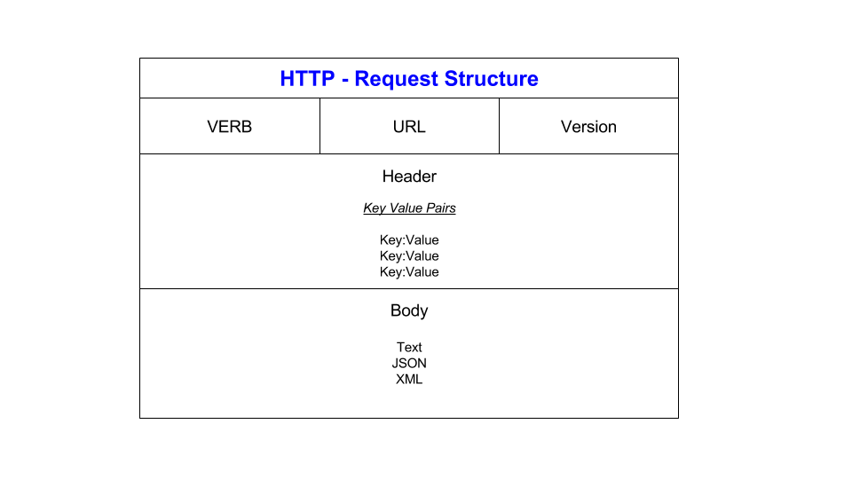

# <ins> APIs
## What are APIs:
API stands for Application Programming Interface. It is a set of rules and protocols that allow different software applications to communicate with each other. APIs enable developers to access the functionality of a system or service without needing to understand its internal workings. They are essential for building software that integrates with other systems, enabling seamless interaction between various applications, services, or platforms. 

**APIs are an accessible way to extract and share data within and across organizations.**

An example is booking flights online. To book your flight, you need to interact with the airline’s website to access the airline’s database to see if any seats are available on those dates, and what the cost might be based on the date, flight time, route popularity, etc.

You need access to that information from the airline’s database, whether you’re interacting with it from the website or an online travel service that aggregates information from multiple airlines
### <ins> How are they used?

APIs are used in a number of different ways and allow different softwares to integrate with each other. Some ways in which they are used are:

### Integration: 
APIs enable different software systems to communicate and share data with each other. For example, a social media management tool might use the APIs provided by various social media platforms (such as Facebook, Twitter, or Instagram) to publish posts, retrieve analytics, or interact with users.

### Development:
Developers use APIs to build new applications or add functionality to existing ones. For instance, a developer building a mobile app might use APIs provided by mapping services like Google Maps to integrate location-based features into their app.

### Automation: 
APIs are often used to automate repetitive tasks or streamline workflows. Businesses might use APIs to connect their internal systems with external services for tasks like data synchronization, order processing, or customer relationship management.

### Accessing Data:
APIs provide a structured way to access data from various sources, such as databases, web services, or IoT devices. This data can be used for analysis, reporting, visualization, or any other purpose required by the application.


APIs are commonly used in web development, allowing websites and web services to interact with each other and with third-party applications.


### Why are they popular?
***Interoperability.*** <br> 
*This is the ability of equipment, systems, apps or products from different vendors to operate together in a coordinated way without an end user's involvement.*

APIs enable different software systems to communicate and work together, regardless of their underlying technologies or architectures. 

This interoperability allows businesses to integrate disparate systems and services, leading to greater efficiency and flexibility in software development.

### A few other reasons why they are so popular:

- **Scalability** - enable different software systems to communicate and work together, regardless of their underlying technologies or architectures. This interoperability allows businesses to integrate disparate systems and services, leading to greater efficiency and flexibility in software development.


- **Speed of Development:** APIs allow developers to leverage existing functionality or data without reinventing the wheel. This accelerates the development process, as developers can focus on building new features


- **Ecosystem Growth:** APIs facilitate the creation of ecosystems around platforms or services by enabling third-party developers to build applications or integrations that extend their capabilities.


- **Flexibility:** APIs provide a flexible way to access functionality or data, allowing developers to tailor their applications


- **Monetization Opportunities:** Companies can monetize their APIs by offering them as part of premium services, charging for access to advanced features or higher usage limits

## Diagram

## What is HTTP
HTTP stands for Hyper Text Transfer Protocol

WWW is about communication between web clients and servers

Communication between client computers and web servers is done by sending HTTP Requests and receiving HTTP Responses

 HTTP messages are text-based, consisting of headers and, optionally, a message body. Headers provide data about the request or response, while the message body contains the actual data being transmitted.

### Request/Response


1. A client (a browser) sends an HTTP request to the web
2. A web server receives the request
3. The server runs an application to process the request
4. The server returns an HTTP response (output) to the browser
5. The client (the browser) receives the response

## HTTP Request structure


- The verb is the api action (see below what the 5 verbs are). This is telling the server what to do / requesting it to do something
- The URL is where the server is located on the internet
- Version is which version of HTTP is being used
* The header is the component that provides data about the request. It consists of key value pairs. For example:
  * Host: Specifies the domain name of the server being requested.
  * User-Agent: Identifies the client making the request, often including information about the browser or device.
  * Accept: Indicates the media types that the client can understand.
  * Authorization: Provides credentials for authenticating the client with the server.
* The body is the data sent by the client to the server for example a form being filled out. This is in a number of formats like JSON XML HTML or TXT
     

## HTTP Response structure


* Similarly, the header is where the data used for understanding what is sent is stored (metadata). Again in key value pairs and in the response we would have examples like:
  * Content-Type: Specifies the media type of the data being sent in the response body.
  * Location: Specifies a URL to redirect the client to (for HTTP status codes like 301 or 302).
  * Content-Length: Indicates the size of the response body in bytes.
  * Cache-Control: Provides directives for caching responses in the client's cache.
* The version is which HTTP version is being used
* The response code is returned by the server after a request and provide information about the request (success or error or redirection) e.g. 400 = bad request
* The body contains the data returned by the server to the client. This data could be the requested resource (e.g., a web page, image, or file) or any other information generated by the server in response to the client's request. Like request bodies, response bodies can also be in various formats, depending on the content being transmitted.

## HTTP Verbs
### GET
requests a representation of the specified resource. It is primarily used to retrieve data from the server without modifying it.
### PUT
 used to update or replace an existing resource on the server with the data provided in the request body. It is idempotent, meaning that multiple identical PUT requests should have the same effect as a single request. 
### POST
used to submit data to the server to create a new resource. It is commonly used when submitting form data or uploading files.
### DELETE
used to remove a resource from the server. It indicates that the client wants to delete the resource identified by the given URI. DELETE requests are idempotent, meaning that multiple identical requests should have the same effect as a single request.
### PATCH
similar to the PUT method but is intended for making partial updates to resource properties rather than replacing the entire resource. 
### HEAD
similar to the GET method but requests only the headers of the specified resource without retrieving the actual content. It is often used to check the status of a resource or to retrieve metadata about a resource without downloading the entire content.
### OPTIONS
used to retrieve information about the communication options available for the specified resource. It allows the client to determine which HTTP methods and headers are supported by the server for a given resource.

## Statelessness
HTTP is stateless, meaning each request from the client to the server is independent and doesn't rely on previous requests.  In other words, the server does not store any information about the client's previous interactions or state between requests

### Examples of stateless HTTP requests:

**GET Request for webpage**
```html
GET /example-page HTTP/1.1
Host: www.example.com
```
**DELETE Request**
```html
DELETE /resource/123 HTTP/1.1
Host: www.example.com
```
"stateful" HTTP requests involve maintaining some form of state or context between requests. This can be achieved through mechanisms like cookies, session tokens, or authentication tokens.
## Caching
Caching is the process of storing copies of frequently accessed or computed data in a temporary storage location, known as a cache, to improve performance and reduce the need to fetch the data from the original source repeatedly.
